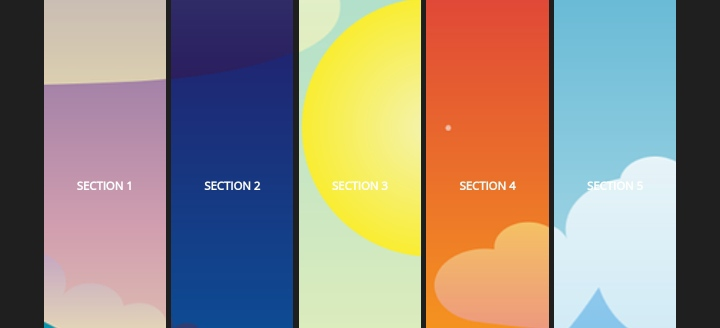

# Animated Carousel

This project implements an animated carousel with interactive elements. It includes HTML, CSS, and JavaScript to create a UX.

## Table of Contents

- [Demo](#demo)
- [Features](#features)
- [Getting Started](#getting-started)
- [Usage](#usage)
- [Contributing](#contributing)
- [License](#license)

## Demo


[Live Demo](https://johndev19.github.io/Animated-Carousel/) - Live Demo

## Features

- Animated carousel with five sections.
- Smooth transitions and interactive elements.
- Dynamic background images for each section.
- Responsive design for various screen sizes.
- Social media icons for easy sharing.

## Getting Started

These instructions will help you set up the project on your local machine for development and testing purposes.

1. Clone the repository:

   ```bash
   git clone https://github.com/JohnDev19/animated-carousel.git
   ```

2. Open the project directory:

   ```bash
   cd animated-carousel
   ```

## Usage

1. Open the `index.html` file in your preferred web browser.

2. Explore the animated carousel by clicking on different sections.

3. Enjoy the smooth transitions and dynamic background images.

## Contributing

Contributions are welcome! If you want to enhance or fix issues in the project, please follow these steps:

1. Fork the repository.

2. Create a new branch for your feature or bug fix:

   ```bash
   git checkout -b feature-name
   ```

3. Make your changes and commit them:

   ```bash
   git commit -m 'Your commit message'
   ```

4. Push the changes to your fork:

   ```bash
   git push origin feature-name
   ```

5. Open a pull request on the original repository.

## License

This project is licensed under the [MIT License](LICENSE.md).
